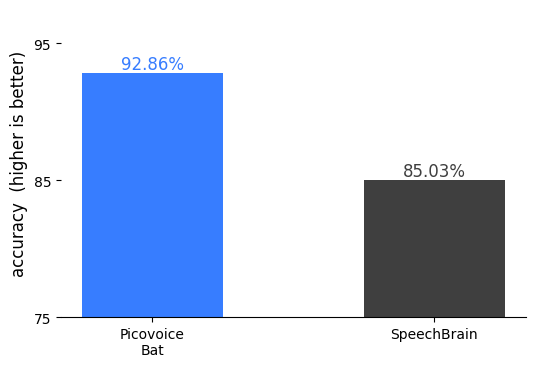
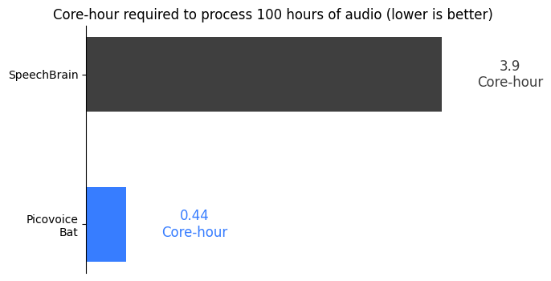
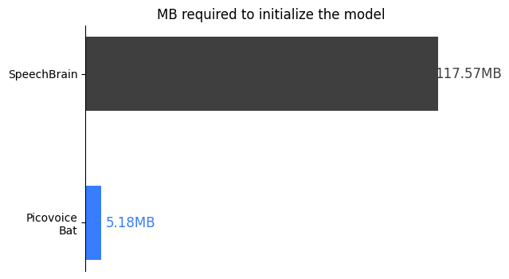

# Language Identification Benchmark

Made in Vancouver, Canada by [Picovoice](https://picovoice.ai)

This repository serves as a minimalist and extensible framework designed for benchmarking various language indentification engines in the context of streaming audio.

## Table of Contents

- [Methodology](#methodology)
- [Metrics](#metrics)
- [Engines](#engines)
- [Usage](#usage)
- [Results](#results)

## Methodology

For this benchmark, audio from various languages is fed into the engine and and the highest scored language is compared to the truth. For un-supported languages, if the engine returns "unknown" it is counted as a success.

## Metrics

### Accuracy Percentage

The Accuracy metric is determined by taking the simple percentage of correct inferences over the total inferences:

$$
ACCURACY = \frac{CORRECT}{INCORRECT + CORRECT}
$$

### Memory Usage

Memory usage is gathered in two places:
- `init` memory is a measure of the memory used when the engine "initializes" (loads the model, prepares internal state, etc).
- `proc` memory is a measure of the additional memory used whilst "processing" audio and producing an inference.

When combined these two values represent "peak" memory usage, or the total memory required to run the engine and produce an inference from audio.

## Engines

- [Picovoice Bat](https://picovoice.ai/)
- [SpeechBrain](https://github.com/speechbrain/speechbrain) ([model](https://huggingface.co/speechbrain/lang-id-voxlingua107-ecapa))

## Usage

This benchmark has been developed and tested on `Ubuntu 22.04` using `Python 3.10`.

1. Install the requirements:

  ```console
  pip3 install -r requirements.txt
  ```

2. Run the command. Specify the desired engine using the `--engine` flag. For instructions on each engine and the required flags, consult the section below.

```console
python3 -m benchmark \
   --engine ${ENGINE} \
   ...
```

Additionally,

#### Picovoice Bat Instructions

Replace `${PICOVOICE_ACCESS_KEY}` with AccessKey obtained from [Picovoice Console](https://console.picovoice.ai/).

```console
python3 -m benchmark \
   --engine bat \
   --picovoice-access-key ${PICOVOICE_ACCESS_KEY}
```

#### SpeechBrain Instructions

```console
python3 -m benchmark \
   --engine speechbrain
```

## Results

This benchmark has been developed and tested on `Ubuntu 22.04`, using `Python 3.10`, and a consumer-grade AMD CPU (`AMD Ryzen 9 5900X (12) @ 3.70GHz`).

### Accuracy

|     Engine      |   Accuracy   |
|:---------------:|:------------:|
|  Picovoice Bat  |    92.86%    |
|   SpeechBrain   |    85.03%    |



### CPU

|     Engine      |  Core-Hour |
|:---------------:|:----------:|
|  Picovoice Bat  |    0.44    |
|   SpeechBrain   |    3.90    |



### Memory

|     Engine      | Peak Memory                                   |
|:---------------:|:---------------------------------------------:|
|  Picovoice Bat  |    5.36MB *(   5.14MB init +   0.22MB proc )* |
|   SpeechBrain   |  333.35MB *( 113.43MB init + 219.92MB proc )* |



### Model Size

|     Engine      | Model Size |
|:---------------:|:----------:|
|  Picovoice Bat  |    4.3MB   |
|   SpeechBrain   |   84.5MB   |
